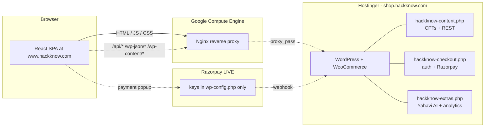

# HackKnow Architecture

Visual reference for **how this repo builds, deploys, and runs**.

For the project overview + REST API table, see [README.md](README.md).
For deployment SOPs, see [HANDOVER/](HANDOVER/) and [DEPLOYMENT_GUIDE.md](DEPLOYMENT_GUIDE.md).

---

## 1. Repository Map

```
Yahavi2022/
├── README.md                 ← project overview (start here)
├── ARCHITECTURE.md           ← this file (visual map)
├── CONTEXT.md                ← extended project context for AI agents
├── DEPLOYMENT_GUIDE.md       ← end-to-end deploy SOP
├── tech-spec.md              ← original tech specification
├── LICENSE                   ← MIT + attribution
│
├── app/                      ★ MAIN FRONTEND (React 19 + Vite + TS)
│   ├── src/pages/            33 React routes (HomePage, ShopPage, …)
│   ├── src/components/       custom components + ui/ (shadcn primitives)
│   ├── src/sections/home/    homepage sub-sections
│   ├── src/lib/              api-base, auth, razorpay, utils
│   ├── public/               splash icons, fonts, OG image, sitemap
│   └── (built artefact deployed to GCE → www.hackknow.com)
│
├── ai-tool/                  ★ SECONDARY FRONTEND ("The Dead Man")
│                              dev port 5174 → deployed to tdm.hackknow.com
│
├── gce/                      ★ SERVER (deploy + nginx for www.hackknow.com)
│   ├── nginx/                production nginx site files
│   │   ├── hackknow.conf
│   │   └── tdm.hackknow.conf
│   ├── auto-deploy.sh        webhook-triggered redeploy script
│   ├── complete-setup.sh     one-shot GCE node bootstrap
│   ├── setup_gce.sh          base server provisioning
│   ├── create_firewall.sh    GCP firewall rules
│   ├── deploy-webhook.js     listener for GitHub push webhook
│   └── deploy-webhook.service systemd unit
│
├── hostinger/                ★ BACKEND (mu-plugins for shop.hackknow.com)
│   ├── README.md
│   ├── mu-plugins/           10 active WordPress mu-plugins
│   │   ├── hackknow-content.php          CMS infra (CPTs, REST, verify)
│   │   ├── hackknow-content-seed.php     auto-seed WC cat + coupons
│   │   ├── hackknow-content-seed-v7.php  sample courses seeder
│   │   ├── hackknow-bulk-products.php    bulk product update API
│   │   ├── hackknow-checkout.php         Razorpay + custom REST + auth
│   │   ├── hackknow-extras.php           Yahavi AI /chat + analytics
│   │   ├── hackknow-brainx.php           Brainxercise API
│   │   ├── hackknow-wallet.php           wallet API
│   │   ├── zz-hk-chat-guard.php          chat rate limiting (loaded last)
│   │   └── zz-hk-dbtools.php             read-only db query helper
│   └── seed/                 Python tooling for bulk content updates
│       ├── content_v2.py     wedding-format HTML generator (207 products)
│       ├── names.py          product name → category mapping
│       ├── update_all.py     parallel REST POSTer (HK_SHOP_TOKEN env)
│       └── README.md
│
├── wp-content/themes/        WordPress admin-panel theme assets
│   └── admin-panel/
│
├── HANDOVER/                 deployment SOPs + project status docs
│
└── _archive/                 LEGACY files (kept for reference, not loaded)
    └── README.md             explains every archived file
```

---

## 2. Build Flow

```mermaid
flowchart TD
    DEV[Developer pushes to main] --> GH[GitHub: gaganchauhan1997/Yahavi2022]
    GH -->|webhook POST| WH[deploy-webhook.js on GCE]
    WH -->|spawn| AD[auto-deploy.sh]
    AD -->|git pull| LOCAL[/var/www/hackknow on GCE]
    LOCAL -->|npm ci, npm run build| DIST[app/dist built bundle]
    DIST -->|nginx serves dist/| BROWSER[Browser at www.hackknow.com]
```

**ASCII fallback:**

```
push → GitHub → webhook → deploy-webhook.js → auto-deploy.sh
                                                    │
                                            git pull on GCE
                                                    │
                                            npm ci && npm run build
                                                    │
                                            nginx serves dist/
```

---

## 3. Runtime Flow



**ASCII fallback:**

```
Browser (React SPA on www.hackknow.com)
   │ all REST calls go to www.hackknow.com (same origin)
   ▼
GCE / Nginx
   │ proxy_pass /api/* + /wp-json/* + /wp-content/* + /graphql/*
   ▼
shop.hackknow.com (Hostinger WP) ──── NEVER exposed to browser
   ├── hackknow-content.php       CPTs hk_course/hk_roadmap/hk_release,
   │                              REST namespace hackknow/v1/*
   ├── hackknow-checkout.php      auth (JWT) + WC + Razorpay order/verify
   ├── hackknow-extras.php        Yahavi AI /chat + admin analytics
   ├── hackknow-brainx.php        Brainxercise
   ├── hackknow-wallet.php        wallet credits
   ├── hackknow-bulk-products.php bulk product CMS API (admin-token gated)
   ├── hackknow-content-seed.php  WC cat + MIS90/STUDENT6FREE coupons
   ├── hackknow-content-seed-v7.php  sample course seed (idempotent)
   ├── zz-hk-chat-guard.php       rate-limits /chat
   └── zz-hk-dbtools.php          read-only db query helper
   │
   ▼
Razorpay (LIVE keys live in wp-config.php only — never in browser bundle)
```

---

## 4. How to Build & Run Locally

```bash
git clone https://github.com/gaganchauhan1997/Yahavi2022.git
cd Yahavi2022/app
npm install
cp .env.example .env.local        # optional: point to prod backend
npm run dev                       # http://localhost:5173
```

Backend mu-plugins are deployed to Hostinger via SFTP — they are not run
locally. To preview locally, the dev server proxies API calls to
`shop.hackknow.com` (production backend).

---

## 5. How a Deploy Happens

1. **Push** code to `main` on GitHub.
2. GitHub fires a **webhook** to `deploy-webhook.js` running on GCE
   (systemd-managed via `gce/deploy-webhook.service`).
3. Webhook handler runs **`gce/auto-deploy.sh`**:
   - `git pull origin main`
   - `cd app && npm ci && npm run build`
   - Copies `app/dist/*` to `/var/www/hackknow/dist/`
4. **Nginx** is reloaded; new bundle is live.

For a fresh GCE node, follow `HANDOVER/GCE_DEPLOYMENT_STEPS.md`
and `gce/complete-setup.sh`.

**Two production sites on the same GCE box:**
- `www.hackknow.com` → built from `app/` → served from `/var/www/hackknow/dist/`
- `tdm.hackknow.com` → built from `ai-tool/` → served from `/var/www/hackknow-tdm/current/`
Both share `shop.hackknow.com` as the WordPress backend.

---

## 6. Entry Points (where to start reading)

| What you want to do | Read this |
|---|---|
| Understand the project | [README.md](README.md) |
| Understand this map | [ARCHITECTURE.md](ARCHITECTURE.md) (you are here) |
| Deploy from scratch | [DEPLOYMENT_GUIDE.md](DEPLOYMENT_GUIDE.md) + [HANDOVER/GCE_DEPLOYMENT_STEPS.md](HANDOVER/GCE_DEPLOYMENT_STEPS.md) |
| Add a new REST endpoint | [hostinger/mu-plugins/hackknow-content.php](hostinger/mu-plugins/hackknow-content.php) |
| Add a new page | [app/src/pages/](app/src/pages/) |
| Bulk-update product content | [hostinger/seed/README.md](hostinger/seed/README.md) |
| Fix a deploy issue | [gce/auto-deploy.sh](gce/auto-deploy.sh) |
| Work on "The Dead Man" (tdm.hackknow.com) | [ai-tool/](ai-tool/) + [gce/nginx/tdm.hackknow.conf](gce/nginx/tdm.hackknow.conf) |
| See what's been retired | [_archive/README.md](_archive/README.md) |
