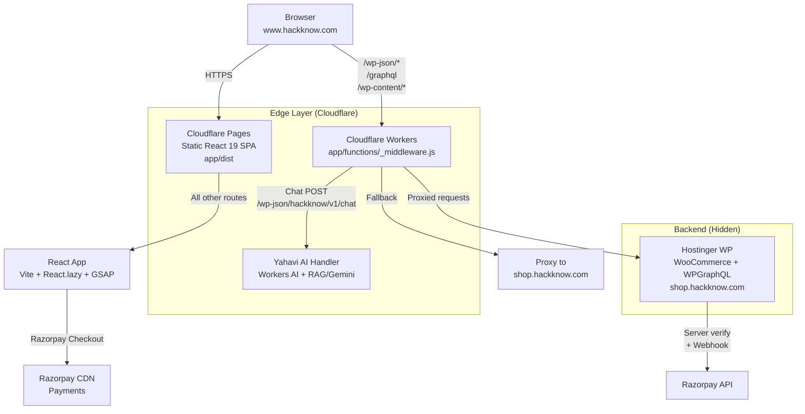

# HackKnow Architecture (Current - June 2026)

> **This document is the single source of truth for the current production architecture.**
> Read alongside `CONTEXT.md` and `FOUNDER.md`.

## High-Level Diagram



## Core Principles

1. **Security by Obscurity + Proxy**: `shop.hackknow.com` is **never** exposed in browser. All WP paths are intercepted at the edge.
2. **Edge Intelligence**: AI chat runs at Cloudflare edge first (fast, cheap). Falls back to WP only on error.
3. **Performance First**: Static SPA + aggressive caching + self-hosted fonts + code splitting.
4. **Digital Goods Protection**: 30-day download expiry enforced in WP mu-plugin.

## Key Data Flows

### 1. Product Catalog Load
Browser → `/graphql` → Workers proxy → WPGraphQL → Products + categories returned

### 2. Authentication
- Google One-Tap → JWT stored client-side
- Email/Password → `/wp-json/hackknow/v1/auth/*` → Custom WP handler

### 3. Checkout & Payment
1. Cart state (React Context)
2. Create order via `/wp-json/hackknow/v1/order`
3. Razorpay popup (client key from env)
4. Payment success → verify signature + amount on server (WP mu-plugin/webhook)
5. Grant download access (30-day expiry)

### 4. Yahavi AI Chat
POST `/wp-json/hackknow/v1/chat` → Workers AI handler (primary) → Fallback to WP if AI fails

## Directory Structure (Relevant)

```
/app/
  ├── src/
  │   ├── App.tsx                 # Routes + lazy loading
  │   ├── components/             # Custom + shadcn/ui
  │   ├── lib/
  │   │   ├── auth.ts
  │   │   ├── checkout-api.ts
  │   │   ├── graphql-client.ts
  │   │   ├── razorpay.ts
  │   └── pages/                  # All route components
  ├── public/
  │   ├── _redirects              # SPA fallback
  │   ├── _headers               # Security + cache headers
  │   └── fonts/                  # Self-hosted woff2
  ├── functions/
  │   ├── _middleware.js         # THE critical proxy + AI router
  │   └── lib/
  │       ├── yahavi-chat.js
  │       └── yahavi-prompt.js
  ├── vite.config.ts
  └── package.json

/wp-content/
  ├── mu-plugins/             # hackknow-checkout.php (download expiry, custom fields)
  └── themes/admin-panel/

/gce/                       # LEGACY - previous deployment
/replit-api-server/         # Possibly legacy or automation
```

## Component Inventory (High-Level)

**Custom UI Components**:
- PhoneMockup3D (CSS 3D hero)
- TiltCard, FlipCardGrid (GSAP)
- CustomCursor
- ScrollTicker, OrbitalBadge
- SplitHero, AnimatedCounter
- ProductCard, CategorySidebar

**State Management**: React Context + useReducer (Cart, Auth, UI, Wishlist)

**Forms**: react-hook-form + Zod (type-safe validation)

**Animations**: Lenis (smooth scroll) + GSAP (most interactions) + CSS transitions

## Why This Architecture Wins

- **Cost**: Cloudflare free tier + Hostinger (very low)
- **Performance**: Edge caching + Workers near user
- **Security**: Backend hidden, cookie domain sanitization, IP forwarding
- **Maintainability**: Clear separation + excellent documentation (CONTEXT + FOUNDER)
- **Future-proof**: Easy to add more edge logic (auth, rate limiting, A/B)

---

*Last updated: June 2026 | Synced with full repo audit*
